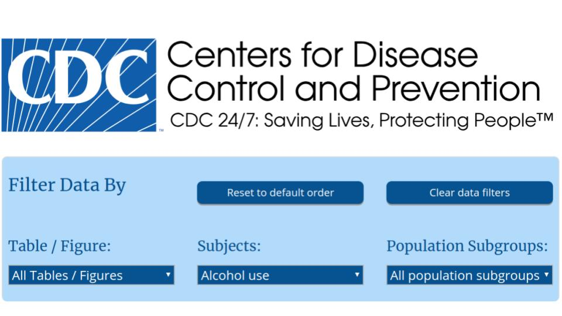
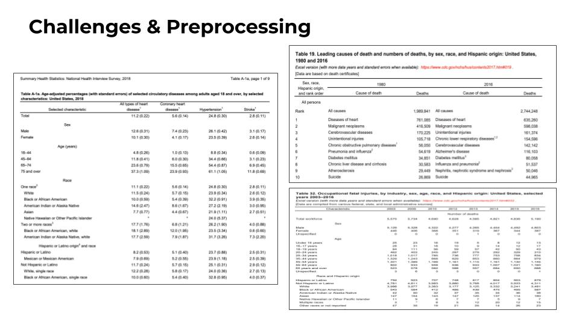
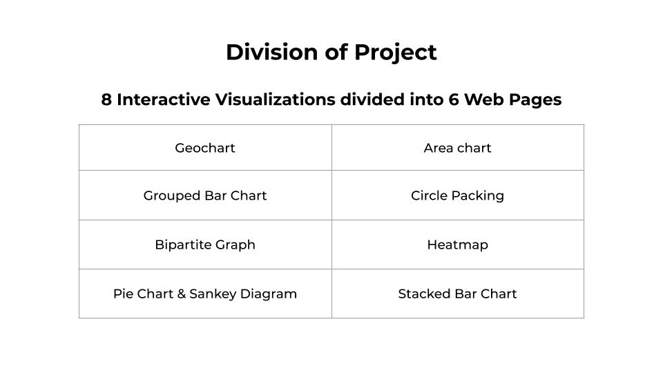
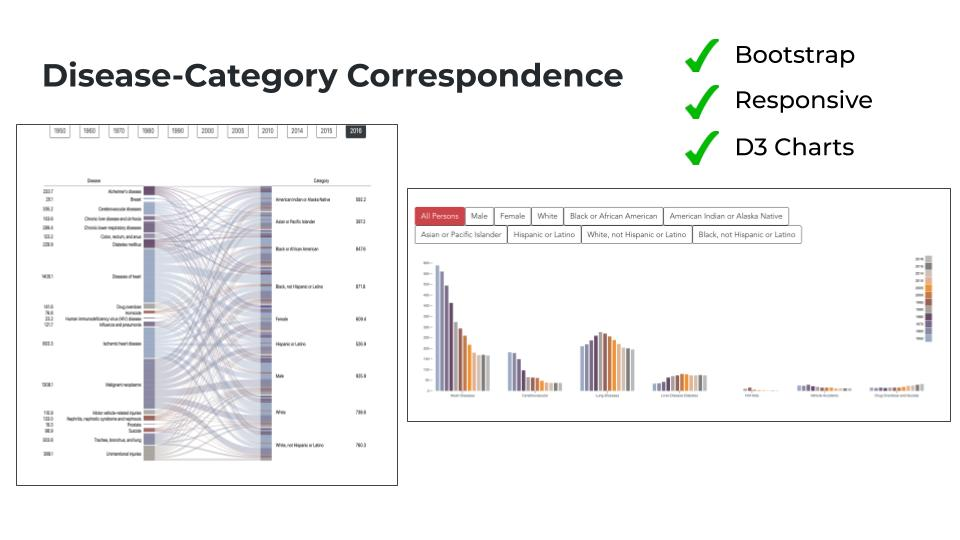
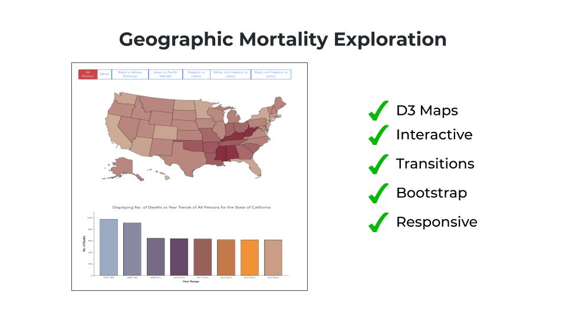
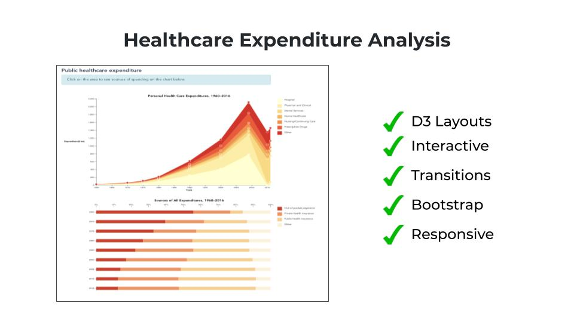
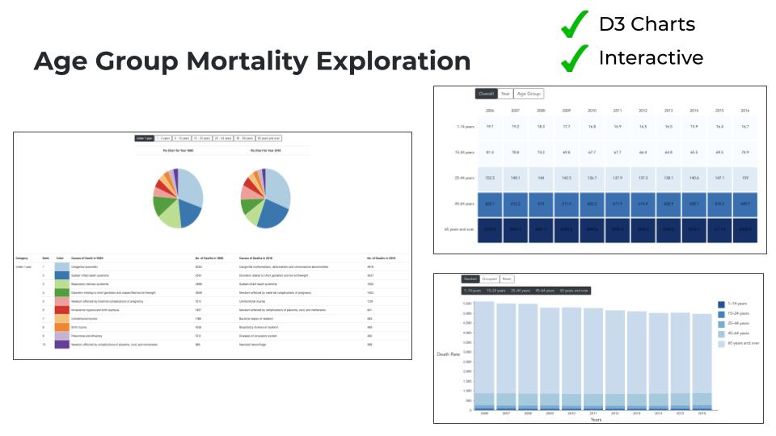
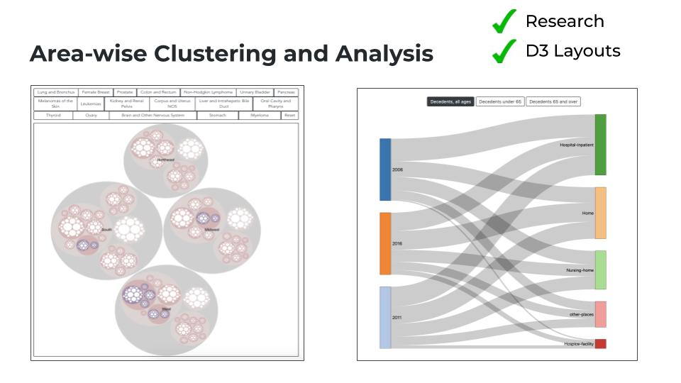

# INF 554 Project 
   
## Slide 0  
        
**Disease Control & Prevention Analysis** is a web application for visualizing data for diseases leading to death in the US.     
     
## Slide 1    
      
* Some of the leading causes of death in the US include heart disease, cancer, alcholism and injuries caused by accidents    
* Many of these are preventable, and being able to visualize the numbers could help us develop improved strategies to avoid and alleviate their occurance  
* We expect our application to be useful for the general public. It will make them more aware of the diseases they are suspectible to based on their location and other demographic traits    
* Medical students could also benefit from knowing which fields require their interest the most    
* Finally, policy makers would greatly benefit from a tool that would help identify major health problems in their region and so they can draft effective policies .     
    
## Slide 2
       
* The main source of our Project was the CDC Website (Center for Disease Control and Prevention).   
        
## Slide 3  
        
* The biggest challenge involved with the project was the amount of data that was present. Even though the data is well seperated into different files, but with 145+ data files, it was a challenge to finalize on the data to visualize.    
* Some of the datasets were just available in PDF Format, which has to be copied and preprocessed intensively to come up with a csv/json file.     
     
## Slide 4     
          
* As seen in the slide, the website consists of 6 different web pages with 8 Visualization as listed.     
      
In the next few Slides, we are going to cover the type of visualization we are planning to make for the project. One common features among all these visualizations is that user will be able to filter their results for a particular cause like heart disease, cancer, diabetes, etc.     
      
## Slide 5 
      
* This visualization consists of two parts i.e. Sankey Diagram and Grouped Bar Chart. 
* Both of them are used to display age-adjusted death rates for selected causes of death, by Category (sex, race, and Hispanic Origin) for selected years 1950-2016 in the United States.       
        
## Slide 6  
   
* This visualization consists of a Choropleth and a Bar Chart. It represents the data from year 1970 to 2016. Clicking a particular race, or origin, the choropleth changes dynamically.      
     
## Slide 7
      
The Stacked Area Chart depicts the trend in public health expenditure in the US by category since the 1960s.      
* Clicking on a specific category in the area chart (or the legend), update the second chart. This allows one to see trends in source of funding for a particular category. Clicking on the white chart area resets the second chart.      

## Slide 8      
  
* The visualization consists of two pie charts and a table, for the year 1980 and 2016. There has been an attempt to compare the leading causes of death in the two respective years.     
* Considering there are more than 35 years of difference, there is an expectation that the causes which were more relevant back then have taken been brought under control.       
* The Heapmap serves to highlight the trend in death rate across time and age-groups. The default “overall” view colors each cell with respect to its number.    
* This is to highlight any concerning number immediately. We can then either select “Age” or “Years”, through which the cells color range can be altered.     
     
## Slide 9  
    
* Derived Analysis - Any Machine Learning Model for prediction of some values. Clustering the States by Machine Learning Models to understand patterns and visualizing it on the Map.    
* The Circle Packing chart displays data of cancer cases by type and by region (division, subdivision, state and city) over the period 1999-2016. Clicking on the button of a cancer type colors the circle of that type in all bubbles.        
      
## Slide 10
    
* This project has been developed on the Vue.js framework. Separate components have been created for each of the charts created in Vue.    
* D3.js is a JavaScript library for manipulating documents based on data,which we have used to construct our charts for visualizing. We used bootstrap for grid layout and CSS for styling and creating buttons.        

                  
To see the project [click here](<http://pdms.usc.edu/~seherkha/proj/>) 