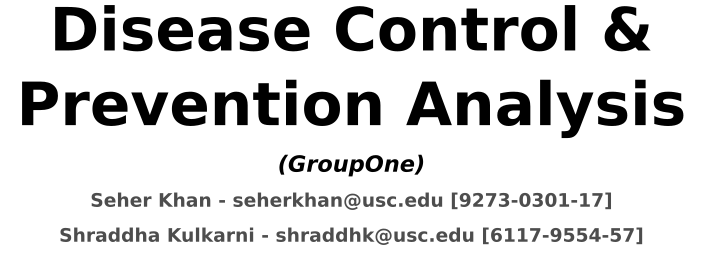
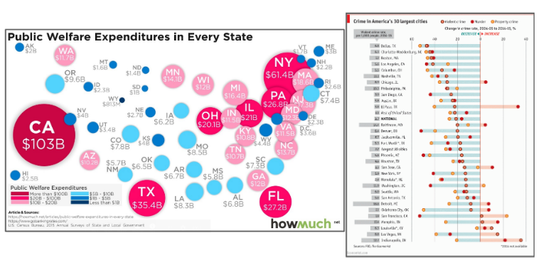
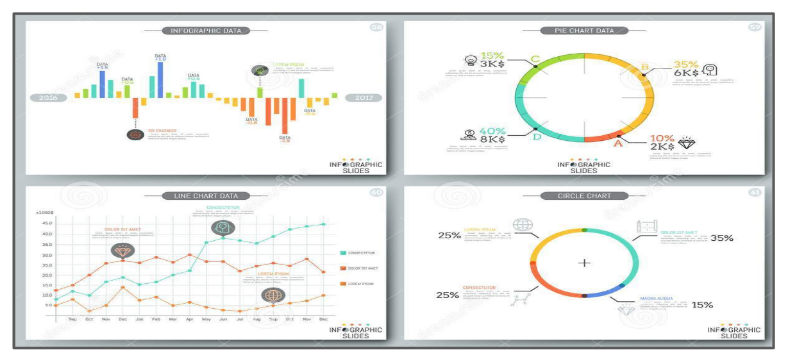
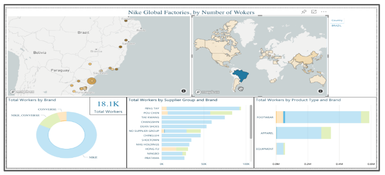
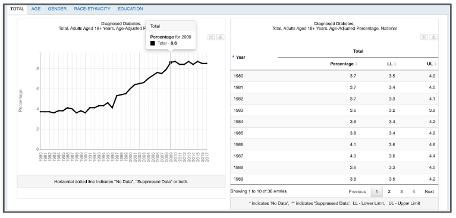
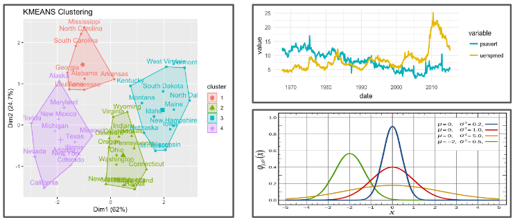
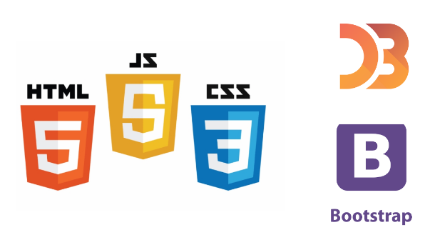
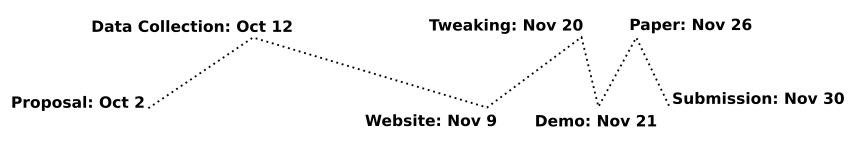

# INF 554 Assignment for 5: Project Proposal

## Slide 0: Cover Slide

**Disease Control & Prevention Analysis** is a web application for visualizing data for diseases leading to death in the US

## Slide 1: Introduction - Motivation

* Some of the leading causes of death in the US include heart disease, cancer, alcholism and injuries caused by accidents
* Many of these are preventable, and being able to visualize the numbers could help us develop improved strategies to avoid and alleviate their occurance

## Slide 2: Introduction - Audience

* We expect our application to be useful for the general public. It will make them more aware of the diseases they are suspectible to based on their location and other demographic traits
* Medical students could also benefit from knowing which fields require their interest the most
* Finally, policy makers would greatly benefit from a tool that would help identify major health problems in their region and so they can draft effective policies

## Slide 3: Overall Picture

## Slide 4: State Comparision

* Ability to compare across all state or selected states

## Slide 5: Zooming into a Specific State

* Increased granuality of data

## Slide 6: Historical

* Ability to see trends across the country and within a region for selected diseases

## Slide 7: Clustering

* We will cluster regions using a simple clustering algorithm such as K-means
* Ability to identify states that face similar issues. This will, e.g. assist policymakers in pinpointing common and adverse policies

## Slide 8: Data Source

* We will be using data from the Centers for Diease Control and Prevention
* Their data can be filtered by time, disease and demographic attributes

## Slide 9: Technologies

* Talk about what we will use
* Talk about how we will divide our work

## Slide 10: Timeline

* Explain